# **ANÁLISE E PROJETO DE SISTEMAS**
## Aula 4
#### Felipe Marx Benghi
Modelagem de processos de negócio
fbenghi@up.edu.com

---

# Objetivos
1. Conceito de Processo e Modelo
2. BPMN

---
## Mapeamento de processos
Para que seja possível criar um sistema de informações computacional (software), que irá atender às necessidades de uma determinada área de uma empresa, é necessário ter pleno entendimento de como a área funciona;

O primeiro passo, então, é fazer um levantamento dos processos que serão afetados pelo sistema que será construído;

---
## Mapeamento de processos
* O mapeamento dos processos atuais, isto é, como eles funcionam antes da informatização é conhecido como **“as is”** (do inglês: “como está”);

Após mapeada situação atual, e já pensando na inserção do sistema informatizado, pode ser proposta uma melhoria nos processos;

* A técnica de revisão e melhoria dos processos é chamada de **“to be”** (do inglês: “a ser”), isto é, como irá ficar.

Tanto a situação atual dos processos como a proposta de melhoria devem ser adequadamente documentadas;

---
## Mapeamento de processos
A documentação deve ser produzida, preferencialmente, utilizando-se recursos que permitam o entendimento por colaboradores das diversas áreas, com diferentes níveis de leitura técnica;

Por isso, tanto na fase de mapeamento de processos, quanto em outras fases da análise, cria-se a documentação seguindo modelos.

---
## Modelo
* Segundo DICIO (2016), modelo é:
Aquilo que serve de objeto de imitação;
Modelo reduzido, reprodução em pequena escala de um aparelho ou de um conjunto.

* Segundo FLUXO (2016):
Um modelo nada mais é do que uma representação simplificada da realidade.

---
## Processo
* Indica ação de avançar;
* Conjunto sequencial de ações com objetivo comum;
* Sequência de atividades realizadas na geração de um resultado.

---
## Processo de Negócios
Segundo FLUXO (2016): 
> um processo de negócio nada mais é do que uma sequência de atividades iniciadas a partir de uma demanda e com o objetivo de entregar algum resultado

Em BPM - Business Process Modeling (Modelagem de Processos de Negócio), um processo é a “sequência de atividades que, quando executadas, **transformam insumos em um resultado com valor agregado**”.

---
# Exemplo

---

## BPMN
BPMN – Business Process Model and Notation (Notação e Modelo de Processo de Negócio).

* É um padrão para modelagem de negócios com notação gráfica para sua especificação;
* Versão atual: 2.0;
* Mantido pelo OMG – Object Management Group, um consórcio de padrões sem fins lucrativos.
    * Membros formais: Axway; IBM; MEGA; Oracle; SAP AG; Unisys.

---
### BPMN - Elementos
* Eventos: 
Representam os acontecimentos; possuem causa (trigger) e consequência (result)

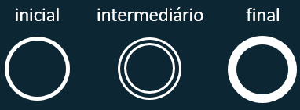

---
### BPMN - Elementos
* Atividades: trabalho executado por um grupo ou organização. Pode ser de diferentes tipos: 
    * Tarefas: atividades  atômicas (uma tarefa), 
    
    
    * Processo e subprocesso: atividades que podem ser decompostas (não atômicas).

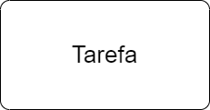 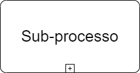

---
### BPMN - Elementos
* Divisores (gateways): 
Controle de divergência e convergência do fluxo de sequência 

Pode ser de diversos tipos.

---
### BPMN - Elementos
* Divisor (gateways) paralelo: 
O fluxo irá seguir por todas as saídas em paralelo
 

---
### BPMN - Elementos
* Divisor (gateways) Exclusivo: 
O fluxo irá seguir por somente uma das saídas em paralelo
 
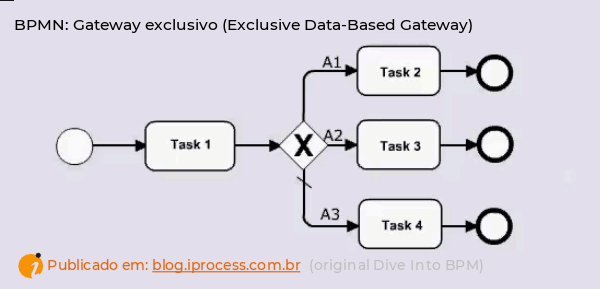

---
### BPMN - Elementos
* Objetos de dados: 
Contém informações que são necessárias à execução da tarefa, ou que são produzidas por ela. 

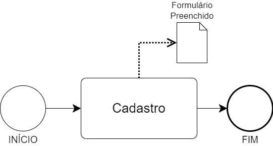

---
### BPMN - Elementos
* Repositórios de dados: 
Conjunto de dados que atendem a todo o processo.

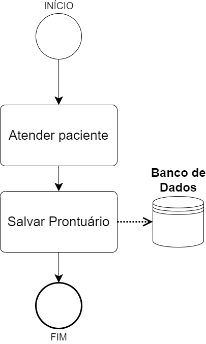

---
### BPMN - Elementos
* Swim Lanes
    * Pool: a organização em si
    * Lane: subdivisão de uma pool

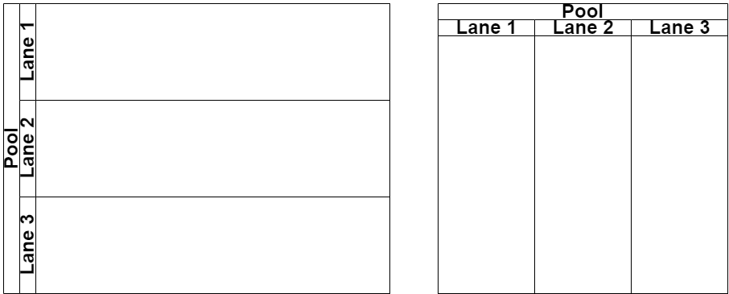

---
### BPMN - Elementos
* Objetos de conexão
    * Fluxo de Sequência: ordem sequencial do fluxo das atividades
    * Fluxo de Mensagem: fluxo das mensagens entre emissor e receptor
    * Associações: associar informações e outros artefatos

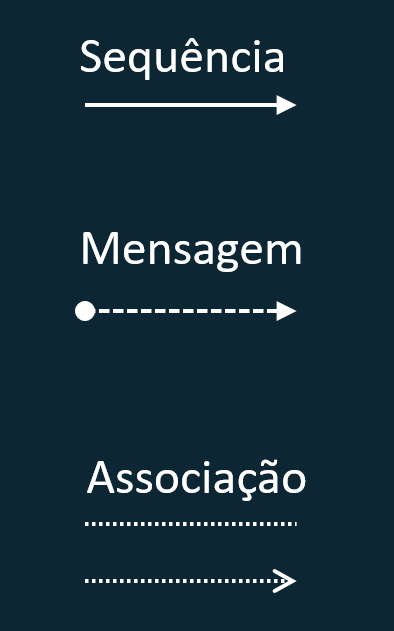

---
### BPMN - Elementos
* Mensagem: 
Descreve o conteúdo da comunicação entre os participantes
 

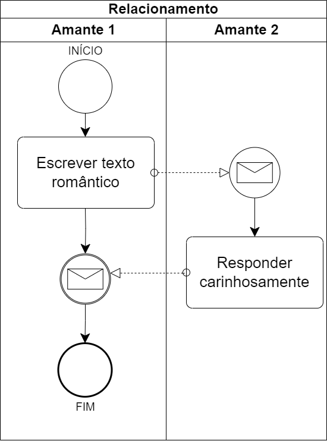

---
### BPMN - Elementos
* Grupos
Denotam um grupo de elementos gráficos que pertencem a um contexto

* Anotações de texto: 
Informações complementares

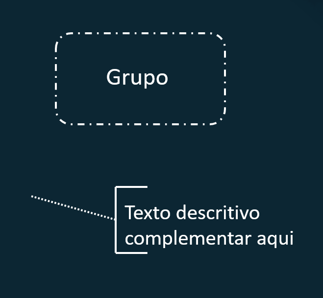

---
## Exemplo
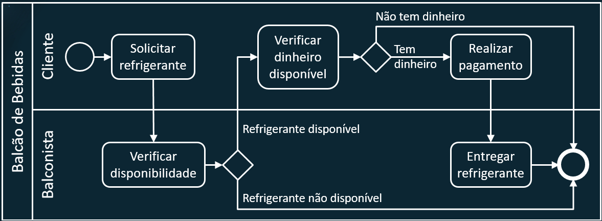

---
## Exemplo
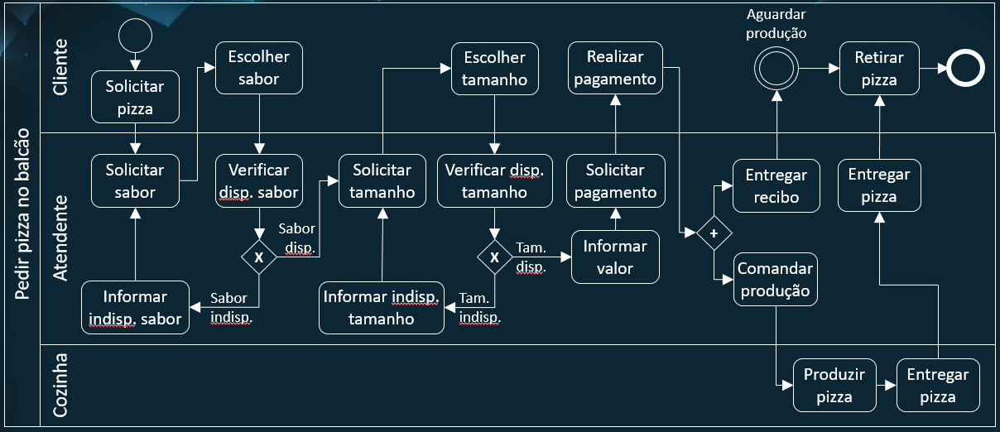

---
## Elementos Estendidos

* Há uma série de elementos estendidos, que são apresentados no guia BPMN;
* Este elementos apresentam variações e diferentes formas de combinações sobre os elementos básicos;
* Consulte o Guia BPMN no material complementar da disciplina.

---
## Exemplo BPMN estendido
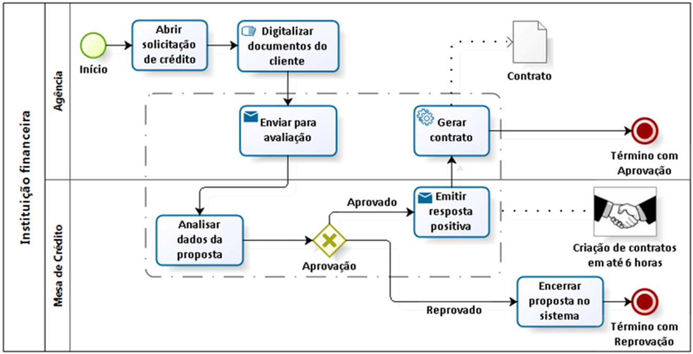